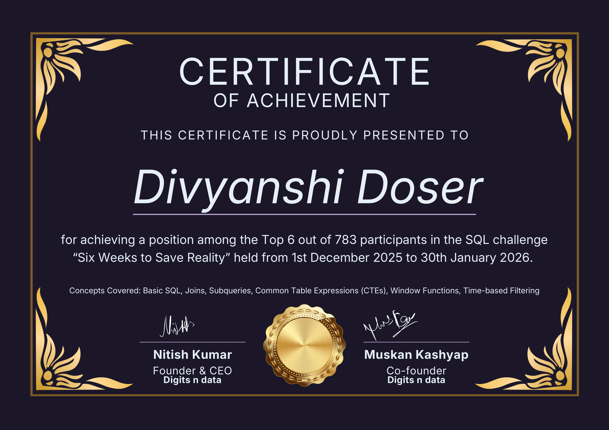

# Digits N Data SQL Challenge

## 🏅 Recognition

Ranked among the **Top 6 performers** in the Digits n Data SQL Challenge 
for solving business-focused analytical SQL case problems.

This repository contains my work for the **Digits N Data – Six Weeks To Save Reality SQL Challenge**.

The challenge follows a story-driven format where each mission presents a unique SQL problem inspired by real-world analytical thinking and creative storytelling.

## What this repository includes
- Mission-wise challenge solutions
- Clear explanation of problem-solving approach
- Structured documentation for each mission

## Challenge Theme
Avengers-inspired storyline combined with analytical SQL problem-solving.

## Skills Practiced
- SQL
- Analytical thinking
- Data interpretation
- Structured problem-solving

This repository is maintained as part of my continuous learning journey.
